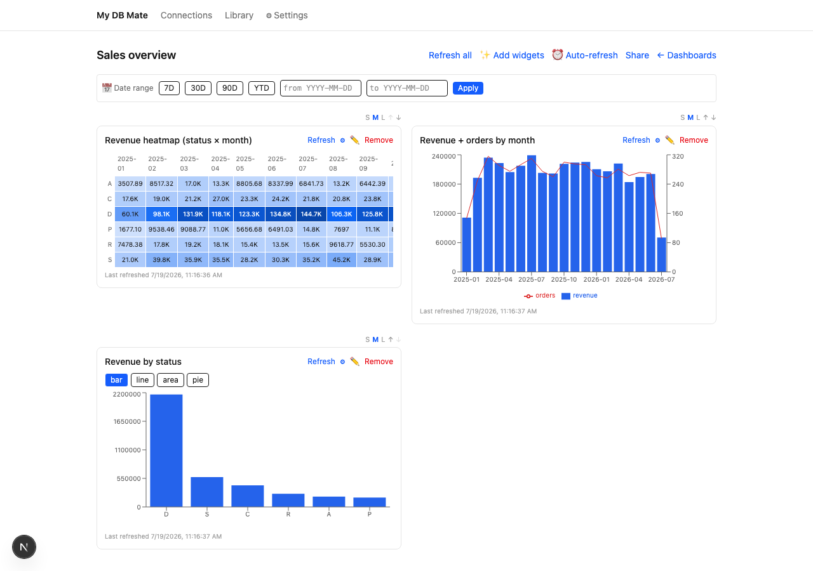
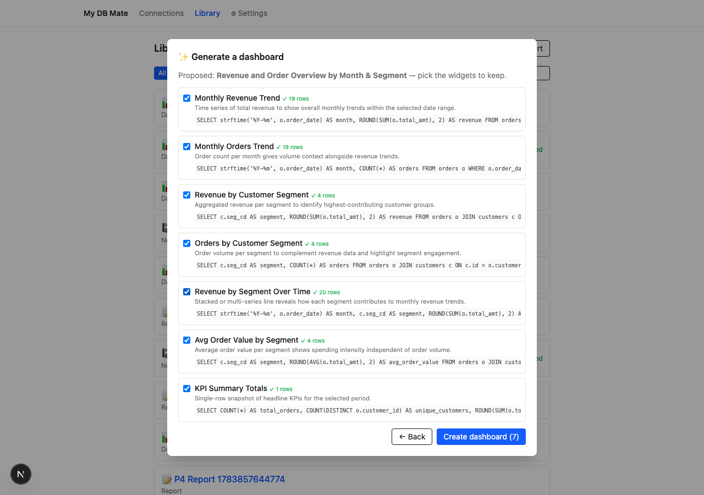
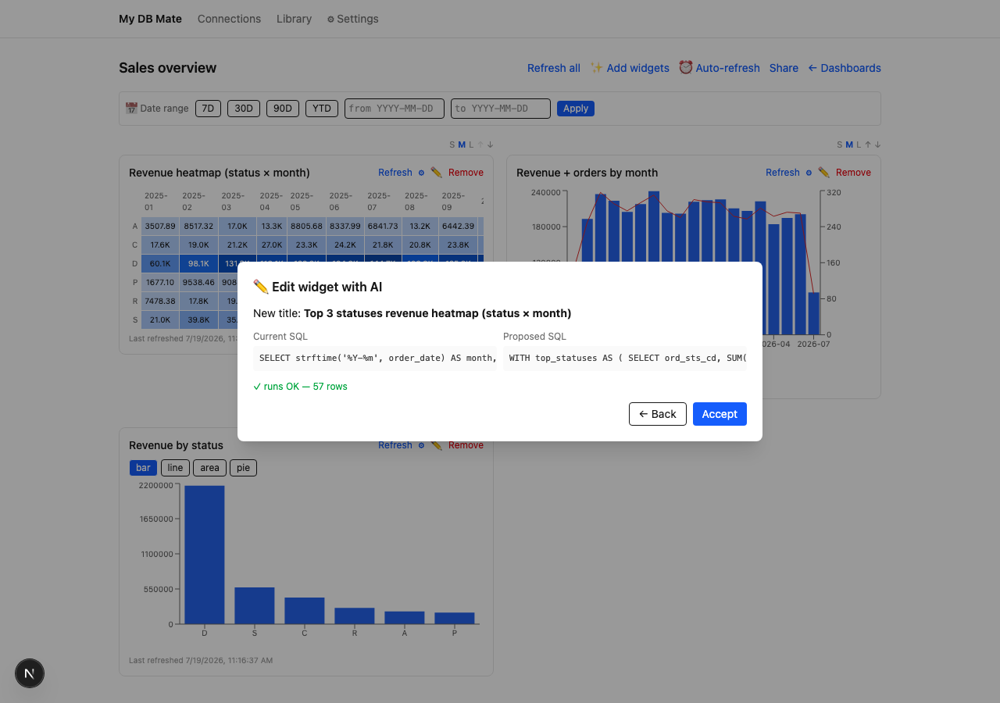
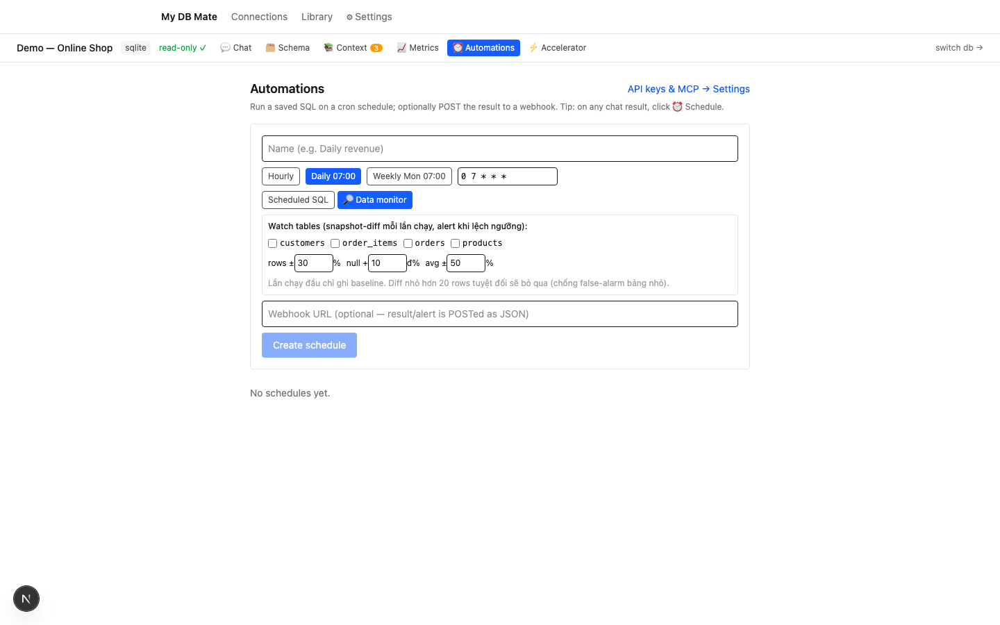
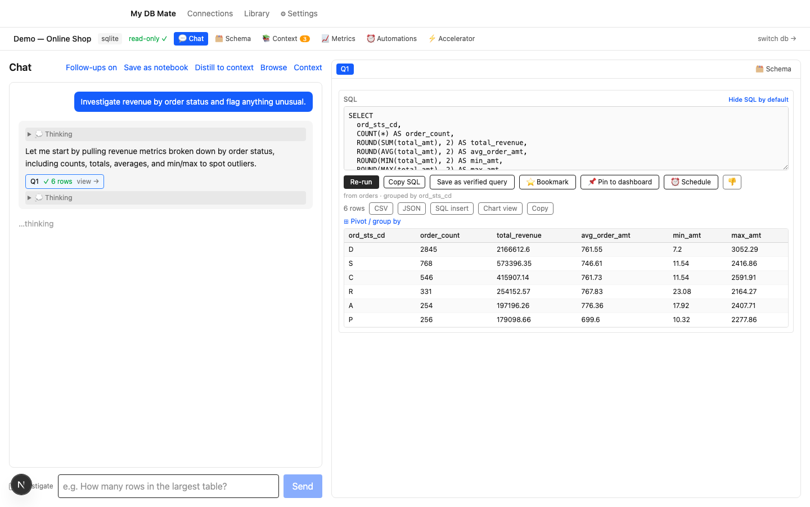

# My DB Mate

[English](README.en.md) | Tiếng Việt

**Chat với database của bạn.** Hỏi bằng ngôn ngữ tự nhiên, nhận câu trả lời dựa trên SQL thật, không cần viết truy vấn tay.


---

## Tại sao tôi làm sản phẩm này

Sản phẩm này dành cho DevOps/DBA quản lý database lớn trong production, ngày nào cũng nhận yêu cầu lấy data ad-hoc từ business, product, finance. Dashboard có sẵn thì cứng, thiếu đúng lát cắt data người ta cần. Viết SQL tay mỗi lần thì tốn thời gian, nhất là hệ thống nhiều bảng, business logic chồng chéo.

Vấn đề không phải là convert câu hỏi thành SQL. LLM giờ làm việc đó khá tốt rồi. Vấn đề là context để AI generate đúng: `usr_stat_cd` nghĩa là gì, "khách hàng active" map vào cấu trúc DB nào, những quy ước chỉ có trong đầu DBA chứ không nằm trong schema. LLM đoán được tên viết tắt thông thường, nhưng không đoán được enum code mờ nghĩa hay tri thức riêng của từng hệ thống. Chỗ đó phải do người dùng bồi đắp dần, không có LLM nào tự lấp được.

Nên My DB Mate không đặt cược vào text-to-SQL. Nó đặt cược vào một lớp context (glossary, chú thích schema, verified queries) mà bạn xây theo thời gian, để AI hiểu đúng hệ thống của bạn hơn.

Và vì đây là DB production, an toàn là điều kiện bắt buộc chứ không phải tính năng thêm: chỉ đọc ép ở nhiều tầng, mọi truy vấn qua một điểm kiểm duyệt, credential mã hoá, mọi lần chạy có audit log.

---

## Bắt đầu

| Bạn là… | Đọc file này |
|---|---|
| **Người dùng** muốn tự cài & dùng | [Hướng dẫn sử dụng (tiếng Việt)](docs/user-guide.md) |
| **Nhờ một AI agent cài giúp** ("đọc file này rồi cài + hướng dẫn tôi") | [`docs/agent-setup.md`](docs/agent-setup.md) |
| Muốn xem **làm được gì + stack + safety model** | [Features & Technical Reference](docs/features.md) |

Cài nhanh (cần Docker):

```bash
./setup.sh                          # tạo .env, sinh khoá mã hoá, hỏi OpenRouter key
docker compose --profile full up    # app + DB + tự migrate → http://localhost:3000
```

---

## Cho người dùng Tableau

Ý tưởng: những **output** Tableau tạo ra — chart, dashboard, metric, insight — nhưng dựng bằng **AI-assist** (mô tả một câu) thay vì kéo-thả. My DB Mate self-host làm phần đó với chi phí $0:

| Bạn cần | Tableau (thao tác tay) | My DB Mate (AI-assist) |
|---|---|---|
| Tạo dashboard | kéo từng sheet vào canvas | ✅ **Mô tả một câu → sinh 4–8 widget** (mỗi query được probe trước khi hiện; widget khớp governed metric thì tái dùng đúng định nghĩa) |
| Sửa một chart | kéo lại shelf, đổi filter/agg | ✅ **✏️ nói một câu** ("chỉ top 10", "thêm filter vùng", "đổi sang stacked bar") → xem diff → áp dụng (run-before-swap, an toàn) |
| Loại chart | ~24 loại + custom | ✅ **11 loại**: bar/line/area/pie, KPI, stacked bar/100%, multi-series, **scatter, combo, treemap, heatmap** — đổi loại không cần query lại |
| Lọc tương tác trên dashboard | dashboard actions | ✅ **Click datapoint → lọc các widget khác** (chạy đúng trên mọi dialect: PG/MySQL/MSSQL/BigQuery/SQLite) |
| Theo dõi metric: sparkline + % + goal | Pulse | ✅ Tab Metrics — 1-click từ kết quả chat, 🎯 target on/off-track |
| Bản tin insight định kỳ (delta, outlier, **top-driver theo dimension**) | Pulse (AI) | ✅ Digest theo lịch → webhook markdown; số tính tất định, LLM chỉ diễn giải; quiet mode |
| Hỏi dữ liệu bằng ngôn ngữ tự nhiên | Ask Data / Agent | ✅ Chat + lớp context bồi đắp theo thời gian |
| Dùng metric đã govern từ AI ngoài (Claude/ChatGPT) | MCP (TC26) | ✅ **MCP tools**: liệt kê + chạy governed metric qua connector, read-only |
| Cảnh báo dữ liệu bất thường | Alerts | ✅ Data-drift monitor (snapshot-diff, ngưỡng tường minh, không ML mờ) |
| Giá | ~$75/user/tháng (Creator) | $0 self-host — chỉ trả API key LLM của chính bạn |
| **Kéo-thả canvas thủ công (VizQL)** | ✅ | ❌ Có chủ đích không làm — thay bằng AI-assist ở trên; cần canvas thủ công hãy dùng [Apache Superset](https://superset.apache.org/) |
| Prep/ETL · governance doanh nghiệp · multi-user RBAC | ✅ | ❌ Chưa có (đang ở phạm vi single-user self-host) |



**Sinh dashboard từ một câu** — mô tả điều muốn xem, model đề xuất 4–8 widget từ schema + governed context; mỗi query được chạy thử (probe) trước khi hiện preview, chọn cái nào giữ rồi tạo:



**Sửa widget bằng một câu** — ✏️ trên widget, nói điều cần đổi; model viết lại SQL (và chart/tiêu đề khi cần), bạn xem diff cạnh nhau rồi áp dụng. Áp dụng theo *run-before-swap*: chạy query mới trước, thành công mới thay — share view không bao giờ thấy trạng thái dở:




Bản tin digest mẫu (JSON POST vào webhook của bạn — n8n / Zapier / script tự đẩy vào Slack):

```json
{
  "name": "Weekly metrics digest",
  "digest": "## Metrics digest\n\nDoanh thu tháng gần nhất giảm mạnh −64.9% so với kỳ trước (70.5K), là outlier ±2σ trên chuỗi 19 tháng…",
  "metrics": [{ "name": "Monthly revenue", "latest": 70526.13, "deltaPct": -64.9, "flags": ["-64.9% vs prev", "outlier ±2σ"] }],
  "monitorFindings": []
}
```

Chi tiết: [Metrics & digest trong user guide](docs/user-guide.md) · [features.md](docs/features.md).

---

## Phân tích sâu (OLAP) — anomaly, monitor, warehouse

Không chỉ chat one-shot. My DB Mate làm được các tác vụ phân tích sâu, chạy cả trên warehouse (BigQuery) với chi phí kiểm soát chặt.

**Phát hiện bất thường có baseline (không "ML mờ").** Tab Data Health kiểm outlier từng cột bằng **median-absolute-deviation (MAD)** — bền hơn ±3σ (σ bị chính outlier làm phồng lên và che mất bất thường thật). Báo cả số σ-outlier lẫn số MAD-outlier; min/max chính xác.


**Data-drift monitor.** Theo dõi bảng theo lịch cron: snapshot rowCount/null-rate/avg mỗi lần chạy, so với **baseline cuộn (rolling MAD)** của các snapshot trước (bắt được "trôi chậm" mà diff-với-lần-trước bỏ sót), alert khi lệch ngưỡng → POST webhook.



**Investigate mode (agentic).** Thay vì dịch 1 câu → 1 SQL, agent tự lập kế hoạch → query → quan sát → tinh chỉnh qua nhiều bước để trả lời câu hỏi phân tích thật.



**BigQuery với cost-safety 3 lớp.** Warehouse tính tiền theo bytes quét, nên mỗi query interactive được **dry-run ước tính + xác nhận** trước khi chạy; mỗi job mang **hard cap `maximumBytesBilled`** (BigQuery tự từ chối trước khi tính tiền nếu vượt); và phân tích nền (dashboards/metrics/reports/anomaly/monitor) đi qua **daily byte-budget** — với **ưu tiên công bằng**: tác vụ bảo trì (monitor/anomaly) chỉ được dùng tối đa nửa budget ngày, chừa chỗ cho refresh quan trọng hơn.


Chi tiết: [features.md](docs/features.md) · [user-guide.md](docs/user-guide.md).

---

## Giấy phép

Phát hành theo **[PolyForm Noncommercial License 1.0.0](LICENSE.md)** — tự do dùng, sửa, chia sẻ cho mọi mục đích **phi thương mại** (cá nhân, học tập, nghiên cứu, tổ chức phi lợi nhuận).

**Dùng cho mục đích thương mại cần giấy phép riêng — liên hệ tác giả tại phucnt0@gmail.com.**

Copyright © 2026 Trọng Phúc ([phuc-nt](https://github.com/phuc-nt)).
