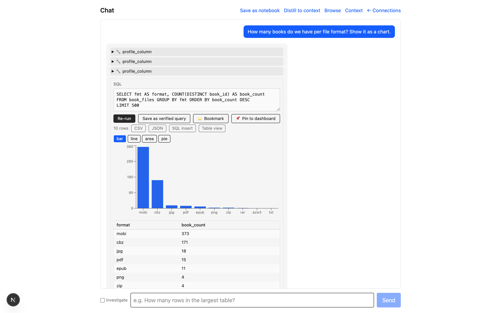

# My DB Mate

[English](README.en.md) | Tiếng Việt

**Chat với database của bạn.** Hỏi bằng ngôn ngữ tự nhiên, nhận câu trả lời dựa trên SQL thật, không cần viết truy vấn tay.



---

## Tại sao tôi làm sản phẩm này

Sản phẩm này dành cho DevOps/DBA quản lý database lớn trong production, ngày nào cũng nhận yêu cầu lấy data ad-hoc từ business, product, finance. Dashboard có sẵn thì cứng, thiếu đúng lát cắt data người ta cần. Viết SQL tay mỗi lần thì tốn thời gian, nhất là hệ thống nhiều bảng, business logic chồng chéo.

Vấn đề không phải là convert câu hỏi thành SQL. LLM giờ làm việc đó khá tốt rồi. Vấn đề là context để AI generate đúng: `usr_stat_cd` nghĩa là gì, "khách hàng active" map vào cấu trúc DB nào, những quy ước chỉ có trong đầu DBA chứ không nằm trong schema. LLM đoán được tên viết tắt thông thường, nhưng không đoán được enum code mờ nghĩa hay tri thức riêng của từng hệ thống. Chỗ đó phải do người dùng bồi đắp dần, không có LLM nào tự lấp được.

Nên My DB Mate không đặt cược vào text-to-SQL. Nó đặt cược vào một lớp context (glossary, chú thích schema, verified queries) mà bạn xây theo thời gian, để AI hiểu đúng hệ thống của bạn hơn.

Và vì đây là DB production, an toàn là điều kiện bắt buộc chứ không phải tính năng thêm: chỉ đọc ép ở nhiều tầng, mọi truy vấn qua một điểm kiểm duyệt, credential mã hoá, mọi lần chạy có audit log.

---

## Bắt đầu

| Bạn là… | Đọc file này |
|---|---|
| **Người dùng** muốn tự cài & dùng | [Hướng dẫn sử dụng (tiếng Việt)](docs/user-guide.md) |
| **Nhờ một AI agent cài giúp** ("đọc file này rồi cài + hướng dẫn tôi") | [`docs/agent-setup.md`](docs/agent-setup.md) |
| Muốn xem **làm được gì + stack + safety model** | [Features & Technical Reference](docs/features.md) |

Cài nhanh (cần Docker):

```bash
./setup.sh                          # tạo .env, sinh khoá mã hoá, hỏi OpenRouter key
docker compose --profile full up    # app + DB + tự migrate → http://localhost:3000
```

---

## Cho người dùng Tableau

Nếu bạn dùng Tableau chủ yếu để *theo dõi chỉ số và nhận bản tin insight* (kiểu **Tableau Pulse**) chứ không phải để kéo-thả dựng visual phức tạp, My DB Mate self-host làm được phần đó với chi phí $0:

| Bạn cần | Tableau | My DB Mate |
|---|---|---|
| Theo dõi metric: sparkline + % thay đổi | Pulse | ✅ Tab Metrics — tạo 1-click từ kết quả chat |
| Bản tin insight định kỳ (delta, outlier) | Pulse (AI) | ✅ Digest theo lịch → webhook markdown; số tính tất định, LLM chỉ diễn giải |
| Hỏi dữ liệu bằng ngôn ngữ tự nhiên | Ask Data / Agent | ✅ Chat + lớp context bạn bồi đắp theo thời gian |
| Dashboard + auto-refresh + share chỉ-đọc | ✅ | ✅ kèm date-range (`{{from}}`/`{{to}}`), KPI tile, stacked bar, multi-series |
| Cảnh báo dữ liệu bất thường | Alerts | ✅ Data-drift monitor (snapshot-diff, ngưỡng tường minh, không ML mờ) |
| Giá | ~$75/user/tháng (Creator) | $0 self-host — chỉ trả API key LLM của chính bạn |
| **Kéo-thả dựng visual (VizQL)** | ✅ | ❌ **Không có và không định làm** — hướng đi là chat-first; cần viz canvas hãy dùng [Apache Superset](https://superset.apache.org/) |
| Prep/ETL · governance doanh nghiệp · multi-user RBAC | ✅ | ❌ Chưa có (đang ở phạm vi single-user self-host) |


Bản tin digest mẫu (JSON POST vào webhook của bạn — n8n / Zapier / script tự đẩy vào Slack):

```json
{
  "name": "Weekly metrics digest",
  "digest": "## Metrics digest\n\nDoanh thu tháng gần nhất giảm mạnh −64.9% so với kỳ trước (70.5K), là outlier ±2σ trên chuỗi 19 tháng…",
  "metrics": [{ "name": "Monthly revenue", "latest": 70526.13, "deltaPct": -64.9, "flags": ["-64.9% vs prev", "outlier ±2σ"] }],
  "monitorFindings": []
}
```

Chi tiết: [Metrics & digest trong user guide](docs/user-guide.md) · [features.md](docs/features.md).

---

## Giấy phép

Phát hành theo **[PolyForm Noncommercial License 1.0.0](LICENSE.md)** — tự do dùng, sửa, chia sẻ cho mọi mục đích **phi thương mại** (cá nhân, học tập, nghiên cứu, tổ chức phi lợi nhuận).

**Dùng cho mục đích thương mại cần giấy phép riêng — liên hệ tác giả tại phucnt0@gmail.com.**

Copyright © 2026 Trọng Phúc ([phuc-nt](https://github.com/phuc-nt)).
