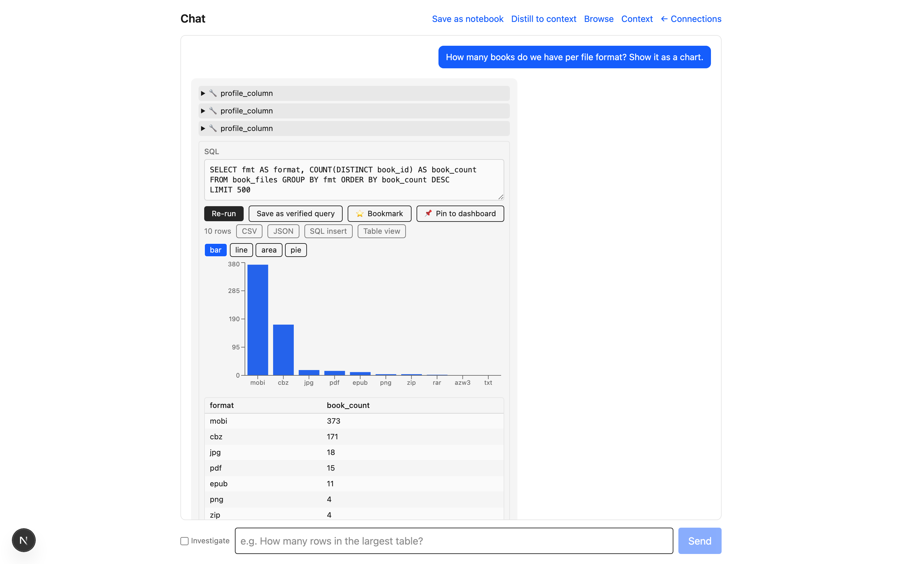
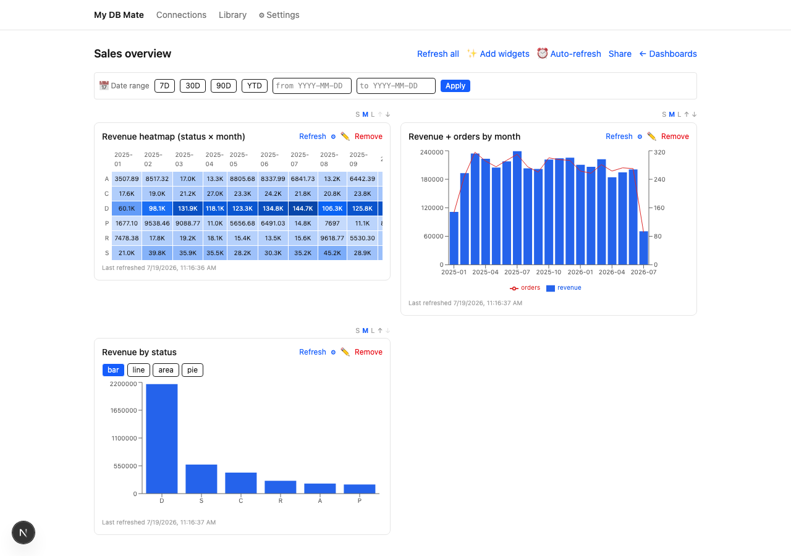
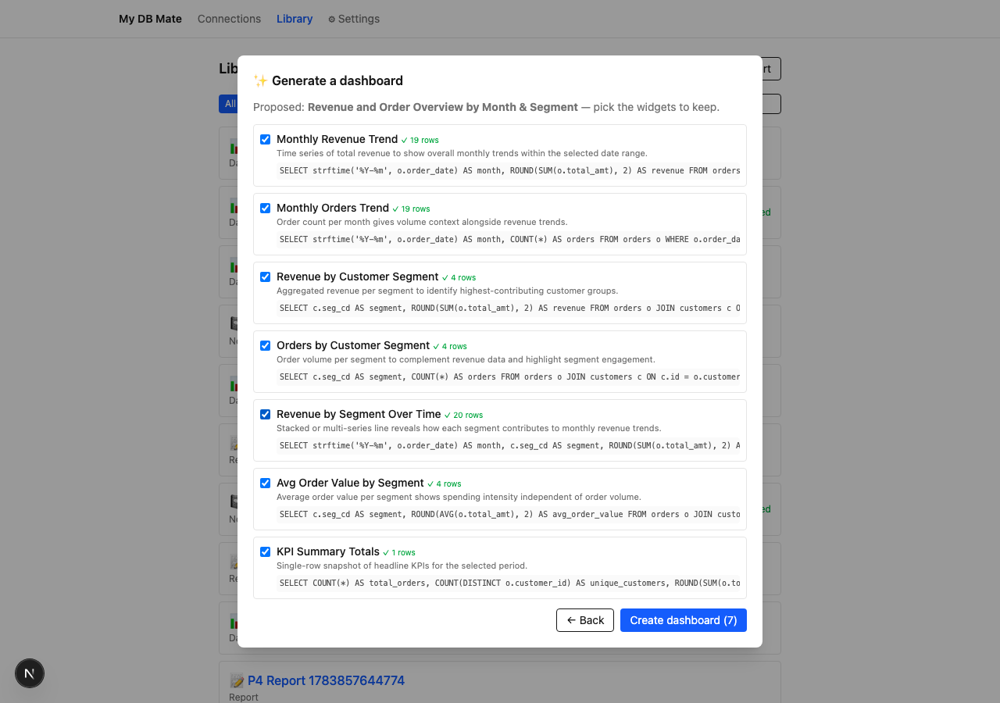
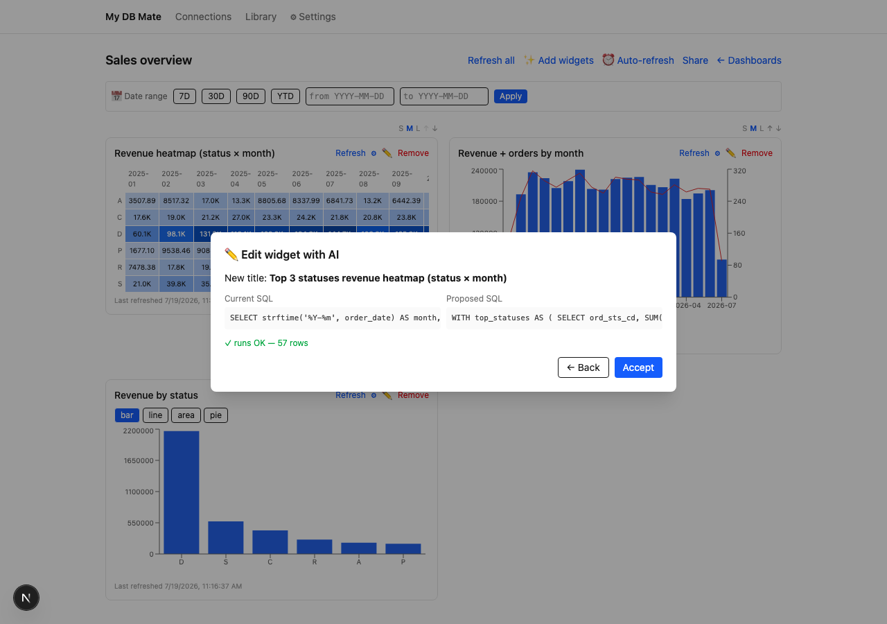
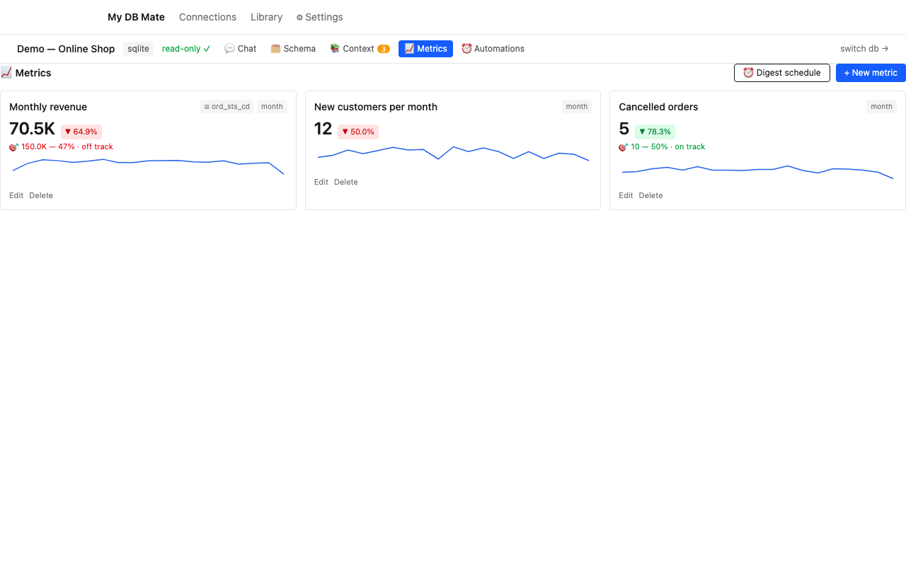
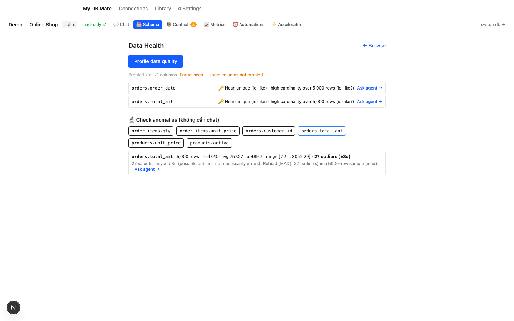
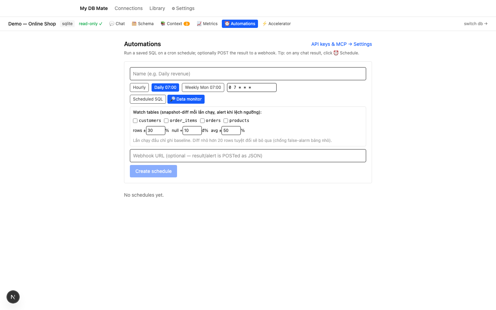
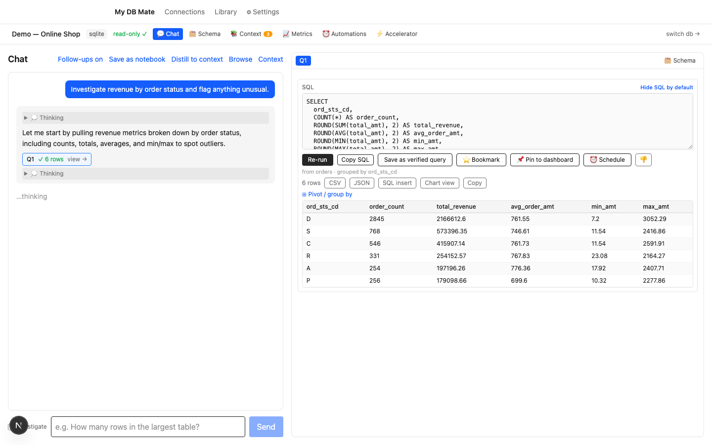
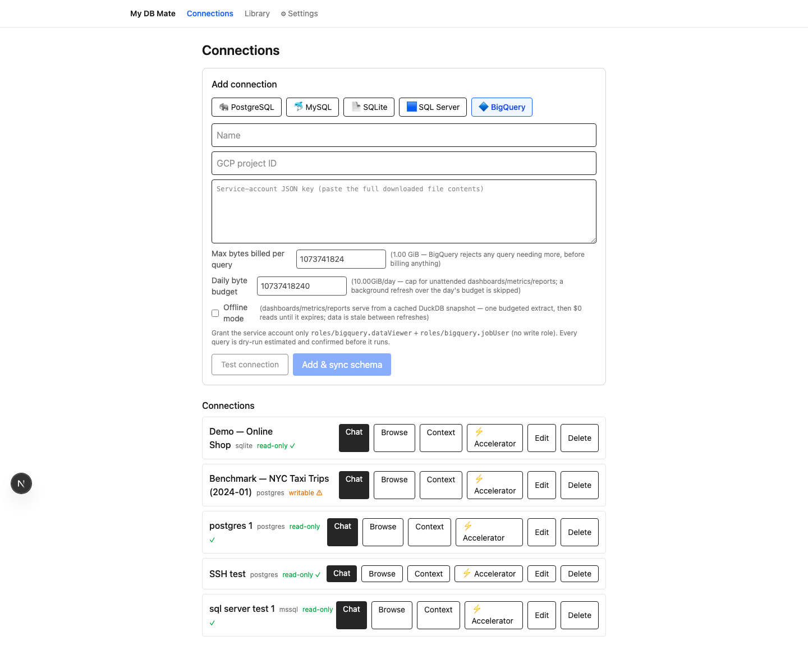

# My DB Mate

[English](README.en.md) | Tiếng Việt

**Chat với database của bạn.** Hỏi bằng ngôn ngữ tự nhiên, nhận câu trả lời dựa trên SQL thật, không cần viết truy vấn tay.



---

## Tại sao tôi làm sản phẩm này

Sản phẩm này dành cho DevOps/DBA quản lý database lớn trong production, ngày nào cũng nhận yêu cầu lấy data ad-hoc từ business, product, finance. Dashboard có sẵn thì cứng, thiếu đúng lát cắt data người ta cần. Viết SQL tay mỗi lần thì tốn thời gian, nhất là hệ thống nhiều bảng, business logic chồng chéo.

Vấn đề không phải là convert câu hỏi thành SQL. LLM giờ làm việc đó khá tốt rồi. Vấn đề là context để AI generate đúng: `usr_stat_cd` nghĩa là gì, "khách hàng active" map vào cấu trúc DB nào, những quy ước chỉ có trong đầu DBA chứ không nằm trong schema. LLM đoán được tên viết tắt thông thường, nhưng không đoán được enum code mờ nghĩa hay tri thức riêng của từng hệ thống. Chỗ đó phải do người dùng bồi đắp dần, không có LLM nào tự lấp được.

Nên My DB Mate không đặt cược vào text-to-SQL. Nó đặt cược vào hai thứ không mất giá khi model giỏi lên:

**Lớp context bạn bồi đắp** — glossary, chú thích schema, governed metrics, verified queries. Đây là *quyết định của tổ chức* ("khách active" tính thế nào, status nào vào doanh thu), không suy ra được từ data dù model thông minh đến đâu.

**Ranh giới bạn chốt** — và ranh giới ở đây áp **cả hai mặt**: thứ agent được *chạy* lẫn thứ agent được *thấy*. Bạn chọn bảng agent được đọc (hoặc chỉ cho đọc lớp governed views); truy vấn ra ngoài bị chặn lúc chạy bằng kiểm tra AST đầy đủ, đồng thời agent không nhìn thấy tên/kích thước bảng nó không được đọc — nên nó không gợi ý, không trích dẫn. Thu hẹp ranh giới thì thấy trước cái gì sẽ hỏng, và cache của dữ liệu vừa cấm bị xoá.

Vì đây là DB production, an toàn là điều kiện bắt buộc chứ không phải tính năng thêm: chỉ đọc ép ở nhiều tầng, mọi truy vấn qua một điểm kiểm duyệt, credential mã hoá, mọi lần chạy có audit log.

**Lập luận trên có đo được không?** Có. Trên bộ [BIRD](https://bird-bench.github.io/) mini-dev, tắt lớp context làm giảm **14 điểm** (`qwen/qwen3.7-max`) và **18 điểm** (`deepseek/deepseek-v4-pro`) execution accuracy trên cùng 100 câu hỏi. Hai model độc lập, cùng chiều, và cách xa biên nhiễu đo được (±3 điểm/lần chạy). Bảy câu mà *cả hai* model chỉ trả lời đúng khi có context — đã kiểm lại qua một lần chạy lặp — đều rơi vào đúng loại tri thức nói ở trên — `RVVT = '+'` nghĩa là đông máu dương tính, `statusID = 2` nghĩa là bị loại — chứ không phải tên cột viết tắt mà model tự đoán được.

Con số tuyệt đối, cách chấm điểm, sai số giữa các lần chạy, và những gì phép đo này **không** kiểm soát: [`docs/benchmark-methodology.md`](docs/benchmark-methodology.md).

---

## Bắt đầu

| Bạn là… | Đọc file này |
|---|---|
| **Người dùng** muốn tự cài & dùng | [Hướng dẫn sử dụng (tiếng Việt)](docs/user-guide.md) |
| **Nhờ một AI agent cài giúp** ("đọc file này rồi cài + hướng dẫn tôi") | [`docs/agent-setup.md`](docs/agent-setup.md) |
| Muốn xem **làm được gì + stack + safety model** | [Features & Technical Reference](docs/features.md) |

Cài nhanh (cần Docker):

```bash
./setup.sh                             # tạo .env, sinh khoá mã hoá, hỏi OpenRouter key
docker compose --profile full pull     # tải image dựng sẵn (nhanh hơn build)
docker compose --profile full up -d    # app + DB + tự migrate → http://localhost:3000
./setup.sh --check                     # kiểm tra cài đặt có thật sự chạy được không
```

`./setup.sh --check` hỏi thẳng app: DB app, migrations, LLM key (có gọi thử 1 lần
để chắc key dùng được), embeddings, thư mục demo. Thiếu gì nó chỉ ra cái đó, và
thoát khác 0 nếu chưa ổn — không phải đợi tới câu hỏi đầu tiên mới biết hỏng.

Muốn build từ source thay vì tải image: bỏ bước `pull`, `docker compose --profile
full up -d` sẽ tự build.

Không cần dùng hết: đặt `MODULES_DISABLED` trong `.env` để tắt hẳn từng module
(notebooks, eval, dashboards…) — mất tab, route trả 404, cron không đăng ký, MCP
không expose tool. Danh sách tên hợp lệ và hệ quả từng cái:
[hướng dẫn sử dụng](docs/user-guide.md#tắt-bớt-module-không-dùng).

Cài xong **thử được ngay, không cần database**: trang Connections có nút **"✨ Try with a sample database"** — 1 click tạo DB shop mẫu (5.000 đơn hàng, mã enum kiểu production thật) kèm sẵn glossary + verified queries, vào thẳng chat. Câu hỏi gợi ý cho từng chức năng: xem [mục "Thử ngay" trong hướng dẫn](docs/user-guide.md#thử-ngay--không-cần-database).

---

## Cho người dùng Tableau

Ý tưởng: những **output** Tableau tạo ra — chart, dashboard, metric, insight — nhưng dựng bằng **AI-assist** (mô tả một câu) thay vì kéo-thả. My DB Mate self-host làm phần đó với chi phí $0:

| Bạn cần | Tableau (thao tác tay) | My DB Mate (AI-assist) |
|---|---|---|
| Tạo dashboard | kéo từng sheet vào canvas | ✅ **Mô tả một câu → sinh 4–8 widget** (mỗi query được probe trước khi hiện; widget khớp governed metric thì tái dùng đúng định nghĩa) |
| Sửa một chart | kéo lại shelf, đổi filter/agg | ✅ **✏️ nói một câu** ("chỉ top 10", "thêm filter vùng", "đổi sang stacked bar") → xem diff → áp dụng (run-before-swap, an toàn) |
| Loại chart | ~24 loại + custom | ✅ **11 loại**: bar/line/area/pie, KPI, stacked bar/100%, multi-series, **scatter, combo, treemap, heatmap** — đổi loại không cần query lại |
| Lọc tương tác trên dashboard | dashboard actions | ✅ **Click datapoint → lọc các widget khác** (chạy đúng trên mọi dialect: PG/MySQL/MSSQL/BigQuery/SQLite) |
| Theo dõi metric: sparkline + % + goal | Pulse | ✅ Tab Metrics — 1-click từ kết quả chat, 🎯 target on/off-track |
| Bản tin insight định kỳ (delta, outlier, **top-driver theo dimension**) | Pulse (AI) | ✅ Digest theo lịch → webhook markdown; số tính tất định, LLM chỉ diễn giải; quiet mode |
| Hỏi dữ liệu bằng ngôn ngữ tự nhiên | Ask Data / Agent | ✅ Chat + lớp context bồi đắp theo thời gian |
| Dùng metric đã govern từ AI ngoài (Claude/ChatGPT) | MCP (TC26) | ✅ **MCP tools**: liệt kê + chạy governed metric qua connector, read-only |
| Cảnh báo dữ liệu bất thường | Alerts | ✅ Data-drift monitor (snapshot-diff, ngưỡng tường minh, không ML mờ) |
| Giá | ~$75/user/tháng (Creator) | $0 self-host — chỉ trả API key LLM của chính bạn |
| **Kéo-thả canvas thủ công (VizQL)** | ✅ | ❌ Có chủ đích không làm — thay bằng AI-assist ở trên; cần canvas thủ công hãy dùng [Apache Superset](https://superset.apache.org/) |
| Lớp semantic / governed data source | Published Data Source, certified | ✅ **Governed scope + virtual datamart** — chốt bảng agent được đọc (chặn lúc chạy), hoặc thay hẳn schema thô bằng view đã duyệt |
| Prep/ETL · multi-user RBAC · quản trị cấp tổ chức | ✅ | ❌ Chưa có (đang ở phạm vi single-user self-host) |



**Sinh dashboard từ một câu** — mô tả điều muốn xem, model đề xuất 4–8 widget từ schema + governed context; mỗi query được chạy thử (probe) trước khi hiện preview, chọn cái nào giữ rồi tạo:



**Sửa widget bằng một câu** — ✏️ trên widget, nói điều cần đổi; model viết lại SQL (và chart/tiêu đề khi cần), bạn xem diff cạnh nhau rồi áp dụng. Áp dụng theo *run-before-swap*: chạy query mới trước, thành công mới thay — share view không bao giờ thấy trạng thái dở:





Bản tin digest mẫu (JSON POST vào webhook của bạn — n8n / Zapier / script tự đẩy vào Slack):

```json
{
  "name": "Weekly metrics digest",
  "digest": "## Metrics digest\n\nDoanh thu tháng gần nhất giảm mạnh −64.9% so với kỳ trước (70.5K), là outlier ±2σ trên chuỗi 19 tháng…",
  "metrics": [{ "name": "Monthly revenue", "latest": 70526.13, "deltaPct": -64.9, "flags": ["-64.9% vs prev", "outlier ±2σ"] }],
  "monitorFindings": []
}
```

Chi tiết: [Metrics & digest trong user guide](docs/user-guide.md) · [features.md](docs/features.md).

---

## Chốt ranh giới dữ liệu (governed scope)

Agent càng tự chủ thì câu hỏi "nó được đọc gì" càng quan trọng. My DB Mate cho chốt ranh giới **theo từng connection**, và ranh giới đó được **chặn lúc chạy query**, không phải chỉ dặn dò trong prompt.

**Chọn bảng agent được đọc.** Mọi thứ ngoài danh sách bị từ chối khi query chạy. Kiểm bằng AST đầy đủ nên bảng giấu trong subquery ở WHERE, thân CTE, derived table hay nhánh UNION đều bị bắt như `FROM` trực tiếp. SQL không parse được thì **chặn**, không cho đi qua — lỗ hổng chuẩn hoá thành lời từ chối, không thành đường vòng.

**Governed views only — thay hẳn schema thô.** Định nghĩa các `SELECT` đã duyệt ngay trong app (inline thành CTE lúc chạy, không cần ai có quyền ghi vào warehouse). Bật chế độ này thì model chỉ thấy view, không thấy cả bảng đã tick trong scope — câu trả lời đến từ định nghĩa đã thống nhất thay vì join tự ráp.

**Thu hẹp ranh giới hiện rõ thiệt hại trước khi làm.** Nút "Check impact" liệt kê metric, saved query, widget, lịch chạy sẽ hỏng; khi áp dụng thì tạm dừng những cái không ai trông, và **xoá cache mà share link còn phục vụ** (widget cache, snapshot notebook/report). Ranh giới mà để lại dữ liệu hôm qua trên trang public thì chỉ là trang trí.

**Ranh giới là thứ agent *được thấy*, không chỉ thứ nó *được chạy*.** Schema summary, payload MCP `get_schema_context`, tool `schema_details`, ghi chú bảng-lớn, và câu hỏi gợi ý đầu phiên chat đều lọc theo scope — nên bảng bị giữ lại không bao giờ bị gọi tên, báo kích thước, hay đem ra gợi ý.

**Datamart advisor (ưu tiên BigQuery).** Đọc đúng những gì app đã có — schema, quan hệ, profile cột, và lịch sử query **thành công** của chính connection (đếm theo *hình dạng* query, bỏ literal) — rồi đề xuất 2–4 mart, mỗi cái nêu rõ một grain và viết hẳn giả định ra. Mỗi câu lệnh được **dry-run thật** trên BigQuery (không tính tiền, không trừ byte-budget); câu nào không chạy được thì hiện mờ kèm đúng lý do warehouse trả về. Xuất DDL hoặc scaffold dbt, hoặc adopt thành virtual view — **advisor không chạy gì cả**.

---

## Phân tích sâu (OLAP) — anomaly, monitor, warehouse

Không chỉ chat one-shot. My DB Mate làm được các tác vụ phân tích sâu, chạy cả trên warehouse (BigQuery) với chi phí kiểm soát chặt.

**Phát hiện bất thường có baseline (không "ML mờ").** Tab Data Health kiểm outlier từng cột bằng **median-absolute-deviation (MAD)** — bền hơn ±3σ (σ bị chính outlier làm phồng lên và che mất bất thường thật). Báo cả số σ-outlier lẫn số MAD-outlier; min/max chính xác.



**Data-drift monitor.** Theo dõi bảng theo lịch cron: snapshot rowCount/null-rate/avg mỗi lần chạy, so với **baseline cuộn (rolling MAD)** của các snapshot trước (bắt được "trôi chậm" mà diff-với-lần-trước bỏ sót), alert khi lệch ngưỡng → POST webhook.



**Investigate mode (agentic).** Thay vì dịch 1 câu → 1 SQL, agent tự lập kế hoạch → query → quan sát → tinh chỉnh qua nhiều bước để trả lời câu hỏi phân tích thật.



**BigQuery với cost-safety 3 lớp.** Warehouse tính tiền theo bytes quét, nên mỗi query interactive được **dry-run ước tính + xác nhận** trước khi chạy; mỗi job mang **hard cap `maximumBytesBilled`** (BigQuery tự từ chối trước khi tính tiền nếu vượt); và phân tích nền (dashboards/metrics/reports/anomaly/monitor) đi qua **daily byte-budget** — với **ưu tiên công bằng**: tác vụ bảo trì (monitor/anomaly) chỉ được dùng tối đa nửa budget ngày, chừa chỗ cho refresh quan trọng hơn.



**Dataset chia sẻ từ project khác.** BigQuery chỉ liệt kê dataset thuộc project của chính connection, nên dataset được grant từ nơi khác (public dataset, cross-project grant) vô hình với sync cho tới khi được ghim. Điền `project.dataset` vào ô **External datasets** trên form connection là sync như bình thường; tên bảng sau đó được viết đủ project lúc render và lúc chạy, để model sinh ra tên mà warehouse thật sự resolve được.

Chi tiết: [features.md](docs/features.md) · [user-guide.md](docs/user-guide.md).

---

## Giấy phép

Phát hành theo **[PolyForm Noncommercial License 1.0.0](LICENSE.md)** — tự do dùng, sửa, chia sẻ cho mọi mục đích **phi thương mại** (cá nhân, học tập, nghiên cứu, tổ chức phi lợi nhuận).

**Dùng cho mục đích thương mại cần giấy phép riêng — liên hệ tác giả tại phucnt0@gmail.com.**

Copyright © 2026 Trọng Phúc ([phuc-nt](https://github.com/phuc-nt)).
