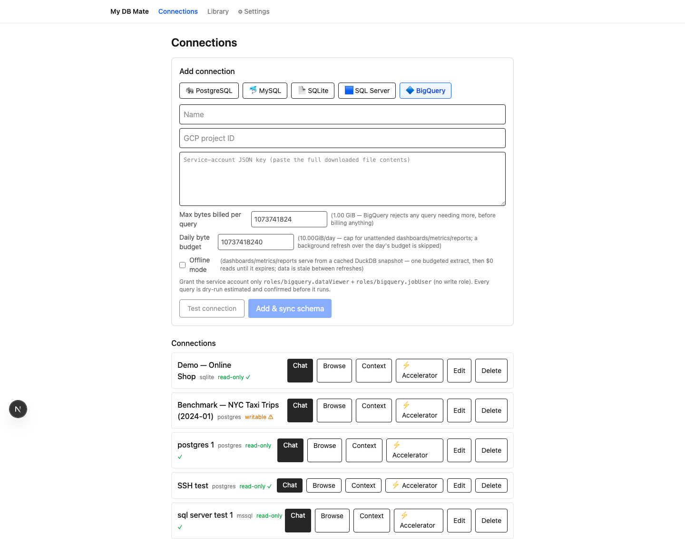
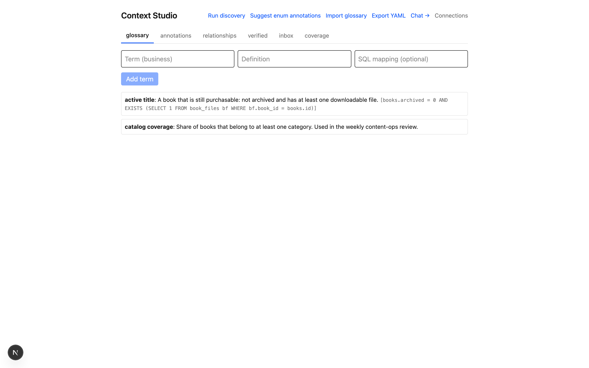
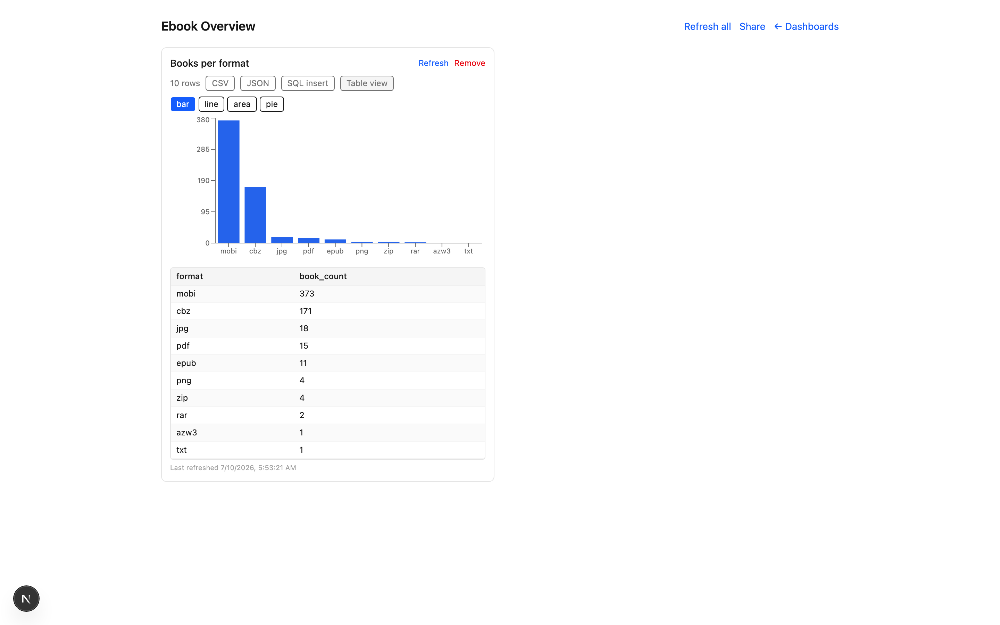
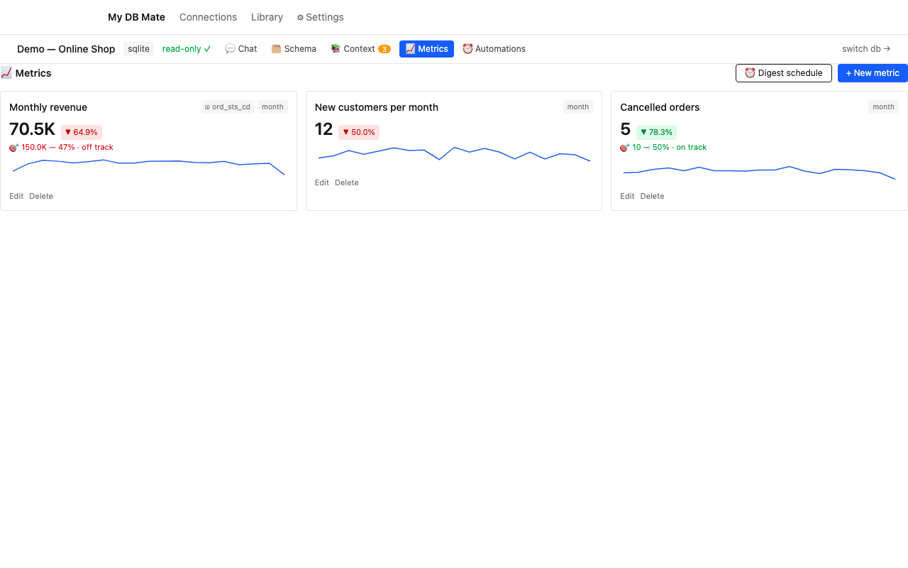
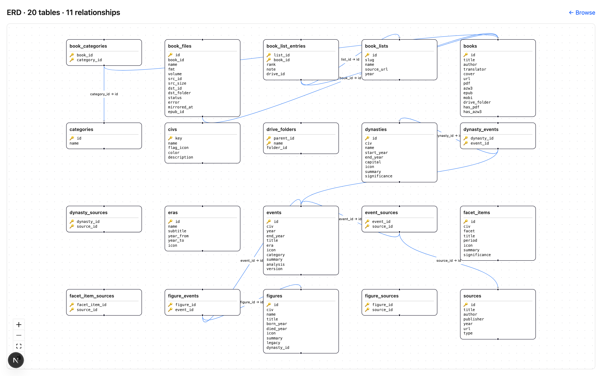
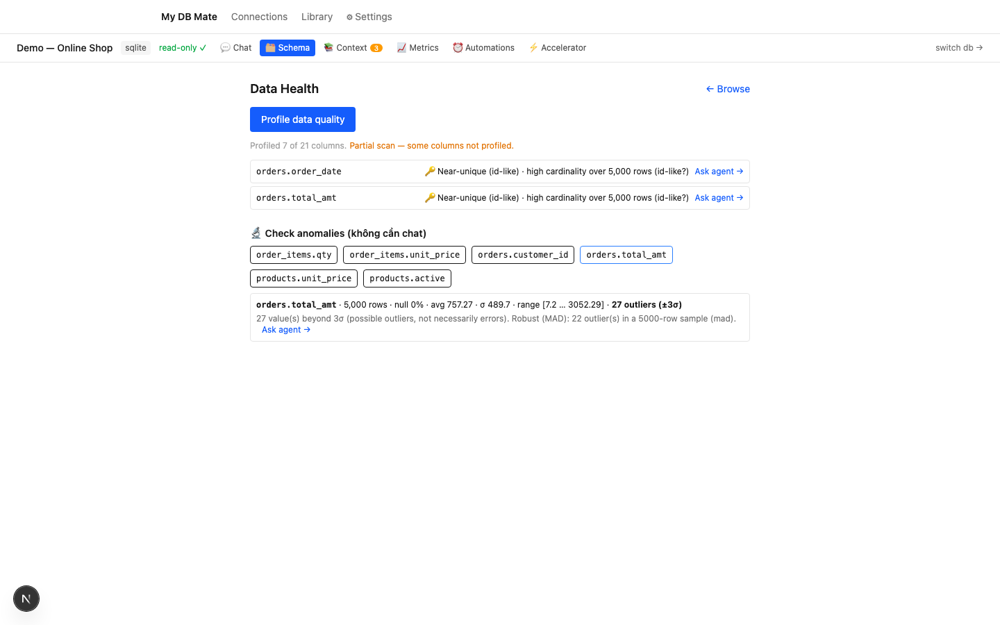

# Features & Technical Reference

Everything My DB Mate does today, the stack it runs on, and the safety model. For a hands-on walkthrough see the [user guide (Vietnamese)](user-guide.md); for the "why", see the [README](../README.md).

> **Status:** Feature-complete for self-hosted single-user use. Every feature was verified end-to-end against real databases and passed an adversarial code review. CI runs the typecheck, lint, build, and the full adversarial safety suite on every push. Multi-user RBAC is the deferred item (single-user dogfood scope).

## What works today

**Layout:** each connection is a workspace at `/db/<id>` (💬 Chat · 🗂 Schema · 📚 Context · 📈 Metrics · ⚡ Accelerator · ⏰ Automations — old URLs redirect); global nav is **Connections · Library · Settings**. Library merges dashboards/reports/notebooks into one filterable list. Settings hosts the pluggable **LLM provider** (OpenRouter / OpenAI / Anthropic / Gemini / **Ollama (local)** — key stored encrypted, env fallback) and MCP API keys. With Ollama, inference runs entirely on your own machine (embeddings were already local via transformers.js), so **nothing — schema, data, questions — ever leaves the box**: the privacy-critical deployment mode for healthcare/finance/gov. No API key; just a base URL (default `http://localhost:11434/v1`) + a tool-calling-capable model (qwen3 / llama3.1+, ≥7B recommended — the agent loop needs reliable tool calls, and small models handle it poorly). The Test button runs a real completion against your server before saving; env fallback via `LLM_PROVIDER=ollama` + `OLLAMA_BASE_URL`/`OLLAMA_MODEL`. Inside chat: a Schema-peek tab in the results panel, a pending-suggestions badge on Context (review inline via a popover), a ⏰ Schedule button on every executed result.

**Analyst automation:** dashboards auto-refresh on a cron; reports regenerate on schedule and deliver full markdown to a webhook (SSRF-guarded; hourly floor — each run is one LLM call); a **data-drift monitor** snapshots row-count/null-rate/avg per watched table and flags when each new snapshot drifts against a rolling MAD baseline of prior snapshots (catches slow creep that a simple vs-previous diff misses). Cold-starts to the exact old threshold behavior when history is short. Snapshot retention changed from "newest 30" to time-based (~90 days) so the baseline spans enough calendar time regardless of run frequency. Runs on all engines including BigQuery within the daily byte budget. Schedules now survive restarts (loaded at server boot). Widgets have S/M/L sizes + reorder, mirrored on shares with print-safe breaks. Notebooks re-run their queries against current data (sensitivity re-checked; narrative untouched, honest refreshed-at stamp) and can feed reports as sources. Health tab checks anomalies per column without a chat turn; investigate mode has an opt-in Deep tier (~2x budget).

**Trust loop:** every answer carries a provenance + confidence badge ("used governed metric X / verified query Y / glossary Z" — high/medium/low by similarity thresholds; a governed metric injected as the authoritative definition shows as its source); a 👎 teach-flow lets you classify what went wrong, fix the SQL inline, rerun, and save the fix as a verified query (logged to `query_feedback`); medium-risk confirmations offer **two candidates** (original + an alternative formulation, each with its own risk) to pick from. The system prompt carries a deterministic date block (exact ISO ranges for "last month", QTD…), 0-row results nudge the agent to verify before concluding, results show a one-line AST-derived lineage (tables · filters · grouping), clear time-series/small-categorical shapes auto-open as charts, and SQL visibility is a per-connection preference. An **answer-verify layer** adds the loop's missing "verify" step: after each successful query, a set of *deterministic* checks (no LLM call, no extra query) run and surface under the result — a "✓ verified · N checks" badge when they pass, an amber caution when one warns. The most valuable is a magnitude check against a **governed metric's own recent history** (a compact cached run): if an answer's number is wildly off that metric's tracked value, the chat says so with the figures — catching a dropped filter or a fan-out join before you trust the number. Other checks flag a JOIN that silently duplicated rows, a result that didn't span the date range asked, or a truncated row-cap. A warn is also fed back to the agent once so it can reconsider mid-loop.

### Chat
- **Chat with a database** — the model explores the schema via tools and runs read-only SQL to answer (agentic loop, not a fixed RAG pipeline). Editable SQL + re-run + CSV export + chart view + copy SQL / copy result.
- **Follow-up suggestions** — after each answer the assistant proposes 2-3 next questions (grounded in the schema + curated context) as one-click chips; toggle off if unwanted. An empty chat shows starter questions drawn from your verified queries.
- **Quick pivot** — regroup any result table (group-by × value × aggregate) client-side without rewriting SQL, over the loaded rows.
- **Readable agent steps** — tool calls show a plain-language label with a running/done/error status, and the model's reasoning (when emitted) is shown collapsible.
- **Live plan card** — for genuine multi-step turns (≥2 tool calls) the assistant message opens with a collapsible "📋 Steps (done/total)" checklist derived from the tool-call stream itself (no extra model call): each step shows its plain-language label, dims with ⏳ while running, and flips to ✓ (or ✗ on error) as it resolves. A one-shot answer stays uncluttered — no card. Distinct from the deeper investigate-mode analysis plan.
- **High-stakes cross-check** (opt-in) — a per-question toggle that, after the model answers, generates 2-3 low-temperature candidate rewrites of its SQL, runs each through the same read-only choke point, and compares the *results*. If they agree you get a "N/N cross-check queries agree" confidence badge; if they disagree, a diff panel shows each query + its differing result so you can pick the interpretation you meant — the divergence itself is the signal (two correct SQLs can legitimately differ, e.g. whether cancelled/refunded orders count toward "total revenue"). Candidates keep the full risk gate and never bypass safety; governance-violating rewrites (dropping a governed metric's filter) are excluded. BigQuery compares dry-run cost estimates instead of executing (bytes = money). This is harness logic — a better model makes a better cross-check — so it resists erosion as models improve. Costs ~2-3× per question, so it is off by default.
- **Stop & interrupt a turn** — a Stop button appears while a turn is streaming. In chat mode Stop *truly halts* the run server-side (the request is aborted, so no further tool calls or model tokens are billed); the interrupted turn is not persisted. The stopped assistant message offers **Keep** (accept the partial answer), **Edit & resend** (prefill the original question to revise and send again), or **Discard**. In investigate mode the run keeps draining in the background so a long investigation survives navigation, and Discard additionally removes the persisted turn server-side (so it does not reappear on reload).
- **Workspace layout** — on wide screens the conversation and the query results split into columns: results collapse to one-line chips in the chat and open full-width in a side panel (edited SQL and chart state survive switching); very wide screens add a session-queries rail. Narrow screens keep everything inline.
- **One-click demo** — "Try with a sample database" on the empty connections page generates a local sample shop DB (deliberately opaque enum codes) with a pre-seeded glossary, then opens a chat against it. No database required to evaluate the product.
- **Engines + cloud + files** — PostgreSQL, MySQL/MariaDB, SQLite, SQL Server / Azure SQL, BigQuery, Cloudflare D1 (remote), and **local DuckDB / Parquet / CSV files** (point at a file, analyze it read-only, no database needed — a $0 personal lakehouse), via a pluggable connection-provider abstraction. A **provider preset** picker pre-fills the port / SSL mode / quirks for common managed databases (see the compatibility table below).
- **Physical safety layer** — every query passes through: read-only connection → AST validation (SELECT-only, blocks CTE-writes and T-SQL `SELECT … INTO`) → per-dialect function denylist (`pg_terminate_backend`, `COPY … TO PROGRAM`, `INTO OUTFILE`, `load_extension`, `ATTACH`, and the T-SQL set `xp_cmdshell`, `OPENROWSET`, `EXEC`/`sp_executesql`, `WAITFOR`, linked-server 4-part names, …) → dialect-aware row cap (`LIMIT` / `TOP`) → audit log. The adversarial suite (writes, DDL, stacked statements, exfil/RCE/DoS across all four dialects) runs as a test gate in CI on every push, with 0% false-positive on legitimate SELECTs.
- **SSH tunnel** — reach a database behind a bastion host: give the SSH host/user and a private key or password, and every connection + query is forwarded through the tunnel. TLS to the database still verifies against the real hostname through the tunnel (verify-full is not silently weakened). The SSH key is encrypted at rest like the DB password.
- **Query accelerator** (opt-in) — for heavy read queries (>100K row estimate), route through a cached Parquet snapshot of the referenced tables instead of the live driver for lower latency and reduced DB load. Configure via the **⚡ Accelerator workspace tab**: enable/disable + set TTL (default 1h), view persisted snapshot status (asOf, sizeBytes, status, lastError), and manually trigger re-extracts. Single ANSI-standard SELECTs only — complex queries silently fall back to live execution. Results show a badge indicating staleness window.
  - **JOIN skew warning** — when a JOIN references multiple tables and their Parquet snapshots were extracted more than half the TTL apart, the badge includes a secondary tooltip warning (e.g. "tables snapshotted up to ~10 min apart") instead of hiding the time spread behind a single "as of" timestamp.
  - **Incremental refresh** (per-table, opt-in) — instead of re-extracting the whole table on every TTL expiry, tables with a confirmed watermark column (auto-detected on common names like `created_at`, `updated_at`, `modified_at`) can opt into delta-only refresh: only new rows (past the last-seen watermark value) are fetched and merged into the existing Parquet snapshot. User must explicitly confirm the watermark column in the UI — auto-detection never silently enables it. Watermark config is separate from the connection-level accelerator settings, so different tables can have different strategies. Configured in the **⚡ Accelerator tab**, persisted per table.
- **BigQuery cost-safety (3 layers)** — BigQuery bills by bytes scanned, so every interactive query is estimated before it runs via a `dryRun` job (free, no bytes billed) that returns `totalBytesProcessed`; the UI shows estimated GB + rough USD cost and requires an explicit confirm click (layer 1, UX-level). Every real query job carries a per-connection `maximumBytesBilled` cap (default 1 GiB, configurable) — BigQuery itself rejects the job before running if it exceeds the cap, and a rejected job is never billed (layer 2, BigQuery server-side backstop). Background analytics (dashboards, metrics, reports, anomaly detection, and the data-drift monitor) that refresh unattended now work with a third layer: a per-connection daily byte budget (default 10 GiB/day ≈ $0.06/day, configurable) gates whether an unattended refresh is allowed — a refresh that would exceed the day's budget is cleanly skipped (not run); uses reserve-then-reconcile accounting so parallel refreshes cannot collectively overspend (layer 3, atomically-checked budget). Setting the daily budget to 0 blocks all background BigQuery. Known limitation: the dry-run estimate can be unreliable (reported as 0 bytes) for external/federated tables — the UI flags this; `maximumBytesBilled` still applies regardless.

- **BigQuery offline mode (opt-in)** — per-connection checkbox to serve dashboards/metrics/reports from a local DuckDB snapshot instead of live queries. One budgeted extract from BigQuery (still passes daily budget + per-query cap), then $0 cached reads until the snapshot expires (default 6h TTL). Data is stale between refreshes; staleness is surfaced via an "as of" timestamp. Reduces unattended cost to a single daily extract.
- **Encrypted credentials** (AES-256-GCM), audit trail on every execution.

### Context Studio — the moat

- **Business glossary, schema annotations, manual relationships, verified queries** — curated per connection, injected into the agent. Multilingual embeddings (works in Vietnamese) with keyword + vector retrieval.
- **Governed metrics as a semantic layer** — a metric you define (name + description + validated SQL + dimensions) is embedded and, when a chat question matches it closely, injected into the text-to-SQL prompt as an authoritative definition, so the agent reuses/adapts the governed SQL instead of re-inventing an aggregation. Keeps the number consistent across chat, dashboards, and reports. Distance-floored so only genuinely-related metrics (and verified-query few-shots) are injected — measured to improve eval accuracy, not just add noise.
- **Knowledge Inbox** — distill a chat session into suggestions the DBA approves; accepted items grow the context store.
- **Mine query history** — turn a database's existing query log into context: reads `pg_stat_statements` / MySQL `performance_schema` digests (or a pasted log), and proposes verified queries (with an LLM-written question) and foreign-key-less relationships (from repeated JOINs) as inbox suggestions. Literals are parametrized before anything is stored or shown to the model, so pasted logs don't carry PII into the context store. Inbox-gated — nothing is auto-applied.
- **YAML export/import** for Git backup (atomic import).

### Intelligence
- **Risk scoring** — EXPLAIN-based tiers: low runs, medium asks for confirmation, high is blocked (a performance guard, never a security control). Confirming happens in the SQL panel (view → / Re-run / Confirm & run anyway) — the agent cannot approve its own queries; after you confirm, the result is recorded back into the conversation so the agent can keep analyzing it.
- **Eval harness** — gold NL→SQL pairs scored by execution + structural match on a fixture DB.
- **Column profiling** (real enum values), schema pruning for large schemas, chart rendering.

### Ecosystem — MCP
- **MCP server** — expose the context + safety layer to Claude/Cursor over stdio. `ask_database`, `run_sql`, `get_schema_context`, `search_verified_queries`, `list_governed_metrics`, `run_governed_metric` all route through the same safety choke point, so a write attempt via MCP is blocked just like in chat, and `ask_database` answers using your glossary + annotations. **Governed metrics over MCP** let an external agent reuse your authoritative definitions instead of writing its own aggregation: `list_governed_metrics` returns id/name/description/grain/dimensions (never the raw SQL — the metric is the contract), and `run_governed_metric` runs one by id and returns its series + delta (read-only; BigQuery via the daily byte budget; a metric id is scoped to the API key's own connection so a guessed id from another connection can't run). *This is the differentiator over a bare DB MCP server: glossary + governance + audit — the same "universal translator" idea, self-hosted.*
- **API keys** (hashed, scoped to a connection + max risk tier), **scheduled queries** (cron, SSRF-guarded webhooks, unattended-risk policy).

### Analyst, Dashboards & Reports

- **Investigate mode** — for "why / compare / trend" questions the agent writes an analysis plan, runs a series of drill-down queries, and concludes with evidence (not a one-shot answer). It **asks a clarifying question** when a request is ambiguous instead of guessing, self-repairs failed SQL, and applies big-table guardrails. An **"Analyze deeper"** button turns any result into an investigation.
- **Investigate-from-finding (root-cause drilldown)** — every monitor finding (Automations run history, Data Health) and anomaly-check result gets a **🔎 Investigate** button: one click opens a chat session where the agent investigates that specific finding (dimension breakdown, time-localization, comparison against the rolling baseline **as of the finding time**) and concludes with evidence. Hard-capped at **5 SQL steps per investigation** — the counter is persisted on the session, so reopening it or sending more messages never resets the cap. The finding context is built entirely server-side from a validated reference (schedule + table + column checked against the synced schema); client-supplied prompt text never reaches the system prompt. On BigQuery each step is admitted like a budgeted query at full priority (dry-run estimate → daily-budget reservation → run under the per-query `maximumBytesBilled` cap → reconcile with real billed bytes) with **no per-step confirm dialog** — the 5-step cap, per-query cap, and daily budget are the cost controls; plain BigQuery chat outside an investigation still requires the interactive cost confirmation as before. The conclusion is saved when the run finishes **while the browser is still on the chat page** — a running investigation shows a "stay on this page" notice and warns on tab-close, because a hard disconnect mid-run can drop the conclusion (the server's background drain isn't guaranteed to outlive the request on a plain self-host / dev server; a fully durable drain would need a long-running host with `waitUntil`-style support).
- **Pin & Dashboards** — pin a chat result as a widget; group widgets on a dashboard; **share read-only** via a signed link. Sharing serves the owner-refreshed cached result — an anonymous viewer never runs a query or sees the SQL.
- **Generate a dashboard from a prompt** — describe what you want ("revenue and orders by month and segment") and one model call proposes 4–8 widgets from the connection's schema + governed context. Each proposed query is **probed before you see it** — run through the exact gate a pin uses (read-only, no sensitive column, no `SELECT *` on a sensitive connection) and trial-run against your data (BigQuery uses a free dry-run) — so a widget that previews as valid can actually be pinned. The preview lists each widget with its SQL, a chart hint, and a pass/fail badge; failed ones are shown with their reason and can't be selected. A widget that matches a **governed metric** reuses the metric's SQL verbatim (badged "governed metric"), keeping the number authoritative. Accepting creates the dashboard and pins the selected widgets in one request; if nothing pins, the empty dashboard is deleted rather than left as an orphan. "✨ Add widgets" repeats the flow on an existing dashboard, scoped to that dashboard's connection. Generation needs a hosted model (not local Ollama, whose structured output is unreliable for this).
- **Dashboard date range** — write `{{from}}`/`{{to}}` (unquoted) in a widget's SQL and it follows the dashboard's date control (7D/30D/90D/YTD/custom). Substitution is server-side with strict ISO validation (injection-proof), placeholder SQL is validated against a probe range at pin time, and every no-range path (Refresh, Refresh all, cron refresh) uses a default last-30-days window — so the cache and the share view always hold the default-range snapshot; a custom range renders transiently and never overwrites what viewers see.
- **Edit a widget with AI** — ✏️ on any widget: say what should change ("only the top 10", "add a filter segment = Consumer", "switch to a stacked bar by status") and the model rewrites the widget's current SQL — and, when the change alters what's shown, its chart spec and title — keeping everything else intact. You review a side-by-side diff with a live probe result (a proposal that doesn't run can't be accepted, and dropping the date-range placeholders shows a warning). Accepting is **run-before-swap**: the new query is gated (same checks as pinning) and executed first, and only a successful run atomically replaces the SQL, risk tier, chart, and cached result — so the shared view never sees a blank or half-updated widget, and a failed/unconfirmed run changes nothing. Owner-only.
- **Cross-filtering** — click a bar/pie/scatter/heatmap datapoint and the other widgets on the dashboard re-run filtered to that value (`WHERE column = value`), Tableau-dashboard-action style. The predicate is injected server-side through the SQL AST (the browser only sends `{column, value}`, never SQL; the literal is escaped so a clicked value can't break out), and cross-filtered runs are transient — a personal filter never overwrites the shared cache the read-only share view reads. Filter chips show at the top with per-chip and clear-all removal; the widget you clicked isn't filtered by its own click; a widget whose SQL can't take the filter (column absent, or a CTE/UNION the rewrite refuses) dims and says "not filtered" rather than passing unfiltered numbers off as filtered. Owner-only (the share view has no query engine); BigQuery cross-filter runs go through the same daily-budget path as any refresh.
- **Chart depth** — a per-widget/per-result chart config picker (type · x · y · series · y2). Eleven types: bar/line/area/pie, **KPI tile** (big number + delta from the result itself), **stacked bar** / **stacked 100%** / **multi-series line** from long-format `(x, series, y)` results, **scatter** (two numeric columns, optional colour series), **combo** (bar on the left axis + line on a second measure `y2`, right axis), **treemap** (part-of-whole for many categories), and **heatmap** (`x × series → colour-by-y` as a CSS grid, axes kept in first-seen order so a time axis stays chronological, empty cells blank and off the colour scale, refused past a 30×30 cap). A chart spec is a *render mapping* (which columns map to which channel); the *data shape* — aggregation, sort, top-N — stays in the SQL, so switching type re-renders without re-querying. The picker only offers a type once its required channels are set (combo needs `y2`; stacked/heatmap need `series`). Widget specs persist and reports carry their spec; old dashboards and specs render unchanged (growing the type list is a zero-migration change).
- **Reports** — gather widgets / verified queries as sources and have the model compose one structured markdown report (executive summary → sections → SQL appendix), versioned and regenerable, with read-only share links and print-to-PDF.

### Metrics & Pulse-style digest

- **Tracked metrics** — a metric is a SQL query returning exactly `(time_bucket, value)`, plus a time grain (day/week/month) and a "good direction" (up/down/neutral — colors the delta badge: a *drop* in cancelled orders shows green). Create one with **📈 Track as metric** on any time-series chat result (name/grain prefilled) or from a verified query, or write the SQL by hand in the Metrics tab.
- **Goals** — an optional target per metric: the card shows a 🎯 line (on/off-track by direction; neutral metrics show distance without judging) and the digest gets a below/above-target flag with the percent reached.
- **Seasonal-naive forecast** — the card sparkline ends with a dashed forecast point for the next bucket ("next ~X ±band"), and the digest reports it with a direction-aware goal verdict ("forecast on track / misses goal"). Deterministic, no ML: the point is the median of prior same-season-bucket values (same weekday for daily metrics, same month for monthly; weekly metrics use the global median) and the band is that bucket's MAD — the same robust-stats used by the anomaly baseline. Cold-start (fewer than 4 observations in the bucket) shows nothing rather than guessing, and a forecast is **never a change flag** — quiet mode only wakes for things that actually happened, not predictions.
- **Top-driver breakdown** — declare ≤3 dimension columns on a metric (e.g. `status, region`) and the digest reports *which slices drove the latest move*: per-slice contribution to the last-bucket delta with a share of total movement. The driver query is generated by AST-rewriting the metric SQL (dimension appended to SELECT + GROUP BY — positional `GROUP BY 1` keeps its meaning) and validated by a trial run **at save time**, so a bad dimension fails with a clear message when you type it, not silently at digest time. Limits stated honestly: plain SELECT + GROUP BY only (no CTEs/multi-statements), additive aggregates (SUM/COUNT) make the most sense, and a driver result that hits the row cap is skipped as unreliable rather than reported wrong.
- **Shape-validated at the choke point** — create/update trial-runs the SQL through the full safety + risk gate and rejects wrong shapes with a plain message; sensitive-column queries can't become metrics; the connection binding is immutable. After that, cards run the stored SQL live (30s timeout; snapshots are a planned optimization).
- **Metrics digest (the "OSS Tableau Pulse" bit)** — a `metrics_digest` schedule runs all metrics of a connection, computes insights **deterministically** (Δ vs previous bucket, vs the 4-bucket average, ±2σ outliers, direction-aware good/bad), then makes **one** LLM call to narrate exactly those numbers (metric names are data-wrapped against prompt injection; raw series never enter the prompt), merges the latest data-drift monitor findings (≤7 days old), and POSTs markdown to your webhook (n8n, Zapier, a Slack bridge — same SSRF-guarded plumbing as other schedules). If the LLM fails, a numbers-only fallback digest is sent instead — the digest always arrives. No webhook? Read it in the Automations run history. Hourly cost floor; ≤20 metrics per digest.
- **Action triggers (webhook-out)** — a rule "when a monitor finding or digest change matches a condition (any finding · name matches a table/metric · |Δ%| ≥ threshold), POST a templated JSON payload to a webhook." Fires evaluate right after the monitor/digest pipeline computes its findings (same change-flag signal as quiet mode — a persistently-missed target or a mere forecast never fires), reuse the same SSRF-guarded egress (private targets need the explicit allowlist), are rate-limited per rule (fires beyond the cap are recorded as *suppressed*, not silently dropped), and every attempt — delivered / failed / suppressed / blocked / template-error — lands in an append-only fire history you can read in the tab (plus a **Test fire** button that sends a clearly-marked sample). Payload templates substitute a fixed set of `{{placeholders}}`, each JSON-escaped, and an invalid render is recorded rather than sent. **Strictly webhook-out**: the module imports no connection provider or query API, so a trigger can never write to your source database — the app's read-only guarantee is intact.
- **Quiet mode** — a digest option that only sends when something actually *changed* (any change flag or monitor finding). All quiet → the run is recorded as skipped, **no LLM call, no webhook**. Keyed off change flags only: a persistently-missed target never spams you daily. The metric queries still run each tick (they're what decides "quiet"), and metric-run errors always force a send so failures can't hide behind silence.

### DB client & analysis

- **Schema browser + ERD** — browse tables → columns (type/PK/FK/row count) and sample rows without asking the chat, and view an interactive entity-relationship diagram of the foreign keys.
- **Execution-plan viewer** — EXPLAIN a query (plan-only, never run) to see its plan and a full-scan warning.
- **Workload advisor** (PostgreSQL + MySQL) — a Schema-tab scan that reads the database's *own* workload statistics (`pg_stat_statements` / `performance_schema` digests) to surface query hotspots ranked by **total** execution time (not mean — a fast query run 50k times outweighs a rare slow one) and to suggest indexes: missing-index candidates from repeated equality/join filters (cross-checked against existing index definitions so it never suggests one that already exists), and unused indexes (`idx_scan = 0`). On PostgreSQL 16+ each single-table candidate is **verified by `EXPLAIN (GENERIC_PLAN)`** — the placeholder-normalized workload SQL is run through a generic plan and the suggestion is marked `✓ verified by EXPLAIN` only when the plan actually shows a Seq Scan on that table; MySQL and PG<16 candidates are shown `unverified` with an explicit caveat (never with fabricated literals — fake selectivity is fake evidence). Every suggestion is **copy-only DDL** — the advisor never runs a `CREATE`/`DROP`. Query text is parametrized inside the collector, so raw literals (a cross-role secret/PII surface) never reach the UI. Other engines fail closed with a plain "not available for this engine" message.
- **Bookmarks + rich export** — save a query for 1-click re-run; export any result as CSV (formula-injection-guarded), JSON, or dialect-aware SQL-INSERT.
- **Anomaly detection** — in investigate mode, the agent can check a column for NULL-rate and numeric outliers. Uses robust median-absolute-deviation (MAD) baseline on a bounded sample to detect outliers while resisting the masking effect where extreme values inflate standard deviation and hide real anomalies. Reports both legacy σ count and robust MAD count; table min/max are exact (SQL). Also tracks drift: persists per-column summary over time and flags when a column's average or null-rate drifts vs its own history (cold-start uses σ behavior when history is short). Runs on all engines including BigQuery within the daily byte budget.

- **Data Health** — a manual scan flags high-NULL, single-value, and id-like columns, with a partial-scan badge.
- **Notebooks** — save a chat session as a read-only, shareable notebook (question → SQL → result → narrative); queries over columns marked sensitive are omitted from the share.

## Provider compatibility

PostgreSQL and MySQL are wire protocols, so any managed database that speaks them works through the same driver. The preset picker fills in the port / SSL / quirks; you can always edit every field or paste a connection string. **✓ = tested against a live instance · ○ = wire-compatible, expected to work (not yet tested).**

| Provider | Wire | SSL default | Status | Notes |
|---|---|---|---|---|
| PostgreSQL (self-hosted) | postgres | your choice | ✓ | Reference engine. |
| MySQL / MariaDB (self-hosted) | mysql | your choice | ✓ | Reference engine. |
| SQLite (file) | — | n/a | ✓ | Local file, opened read-only. |
| SQL Server / Azure SQL | mssql | your choice | ✓ | T-SQL safety layer (own denylist + adversarial suite); read-only = a `db_datareader`-only login. Also `GRANT SHOWPLAN` to that login (metadata-only) so the risk gate can estimate cost — without it every query asks for confirmation. |
| BigQuery | REST (service account) | n/a | ✓ | Cost-based, not wire-compatible — own connector. Auth via service-account JSON key (`roles/bigquery.dataViewer` + `roles/bigquery.jobUser`, no write role). Interactive queries dry-run estimated + confirmed; background analytics (dashboards/metrics/reports) run within a daily byte budget. Daily budget + offline mode (DuckDB snapshot) gate unattended costs. See [Deferred](#deferred) for intentionally-blocked features pending demand. |
| Cloudflare D1 | REST | n/a | ✓ | Remote HTTP provider. |
| DuckDB files (.duckdb / Parquet / CSV) | — (local file) | n/a | ✓ | Point at a `.duckdb` file, a `.parquet` file, or a folder of CSV/Parquet — analyze it read-only with no database to run. Files are ingested into an in-memory instance, then the filesystem is **locked** (`enable_external_access=false` + `lock_configuration=true`) before any query, so a query can't read another file (a replacement scan `FROM '/etc/passwd'` fails at the engine). Paths must live inside `DUCKDB_DATA_DIR` (default `./data-files`); queries run in a forked child with a kill-timeout. Own `duckdb` dialect + denylist. |
| Neon | postgres | require | ○ | Pooled host works; needs SNI (set the real host if tunneling). |
| Supabase | postgres | require | ○ | Default preset uses the pooler (6543); direct 5432 is often IPv6-only. |
| AWS RDS / Aurora (PG & MySQL) | postgres/mysql | require | ○ | verify-full + the RDS CA bundle for strict verification. |
| PlanetScale | mysql | require | ○ | TLS mandatory. |
| TiDB Cloud | mysql | require | ○ | Serverless on port 4000. |
| Timescale Cloud | postgres | require | ○ | — |
| CockroachDB | postgres | verify-full | ○ | Serverless needs `options=--cluster=<id>` — preserved from the pasted URL or set in the Postgres options field. |
| Aiven (PG & MySQL) | postgres/mysql | verify-full | ○ | Private CA — paste the console CA into the CA field. |
| Azure SQL | mssql | require | ○ | TLS on 1433; use a db_datareader-only login + `GRANT SHOWPLAN`. |

Missing a provider that speaks PG/MySQL wire? Use **Generic** and fill the fields — it will very likely work.

## Stack

Next.js 16 (App Router) · TypeScript · AI SDK v7 + OpenRouter (`qwen/qwen3.7-max`, configurable) · Drizzle ORM · Postgres 17 + pgvector (app DB) · transformers.js (embeddings) · `@modelcontextprotocol/sdk` · `better-sqlite3` / `pg` / `mysql2` / `@google-cloud/bigquery` · `node-sql-parser` · `node-cron` · `@xyflow/react` (ERD) · `react-markdown` (reports/notebooks).

## Safety model

The real boundary is a **SELECT-only DB user** — grant your connection only `SELECT`. The application layers add defense in depth (read-only transaction re-applied per connection, AST + denylist validation, statement timeout, `multipleStatements: false`), but none of them replace a least-privilege grant. Point at a read replica where possible.

**TLS to your database:** three modes per connection. **Encrypt only** (`require`) turns TLS on without verifying the server certificate — managed clouds with a private CA connect without setup, but the channel is not MITM-proof. **Encrypt + verify** (`verify-full`) verifies the certificate chain and hostname — against the system CA store, or against a CA certificate (PEM) you paste into the connection form for private-CA providers (Supabase, Aiven, self-managed). `sslmode=verify-full` / `verify-ca` in a pasted connection string select the verify mode automatically. Use verify-full whenever the path to your DB crosses an untrusted network.

**Share links** (dashboards/reports) use an unguessable 128-bit link as a capability — anyone with the link can view the cached result, so treat share links like passwords. Intended for localhost/LAN or trusted sharing; put an auth proxy in front before exposing the app to the internet.

## Deferred

Multi-user RBAC / approval queue, cross-database chat (one session spanning multiple connections), and an eval-regression guard on live production DBs are intentionally out of scope for the current single-user, self-hosted target.

**BigQuery — background analytics now supported.** BigQuery connections work for interactive "run a query" (chat + SQL panel) and unattended background analytics (dashboards/metrics/reports) within a configurable daily byte budget and optional offline/cached mode. Anomaly detection, the data-drift monitor, and now **column profiling + Data Health scans** run on BigQuery within the daily byte budget (as maintenance-tier actors, capped at half the daily budget; Data Health additionally caps a BigQuery scan at 20 columns by default — `DATA_QUALITY_MAX_COLUMNS_BIGQUERY` — because each profiled column scans real bytes). Remaining **explicitly-blocked** features (pending demand) each fail closed with a typed "not yet supported for BigQuery connections" message rather than running an un-budgeted scan: the query accelerator (OLTP-only; BigQuery has its own caching), mine query history, MCP raw-SQL execution (`run_sql` — `ask_database` still works, it routes through the budgeted agent), scheduled raw queries (the `sql`/`question` schedule modes; the budgeted dashboard/report/monitor/metrics-digest schedule modes DO run), notebook re-run, schema-browser query execution, the eval harness, and a bookmark's re-run action. This is a cost-safety scope decision, not a bug — intentionally narrow until there's demand for a budgeted/metered version of any of these.

**BigQuery budget fairness (priority tiers).** The daily byte budget is one per-connection pool shared by all background surfaces. Admission is priority-aware so a periodic maintenance tick can't starve user-facing refreshes: interactive queries and the BI surfaces (dashboards / metrics / reports) reserve against the full budget, while the lower-priority maintenance actors (anomaly + data-drift monitor) may reserve against at most half the day's budget — leaving headroom for the higher-priority surfaces. A budget block distinguishes a priority-ceiling reject from a genuinely-exhausted pool in its message.
